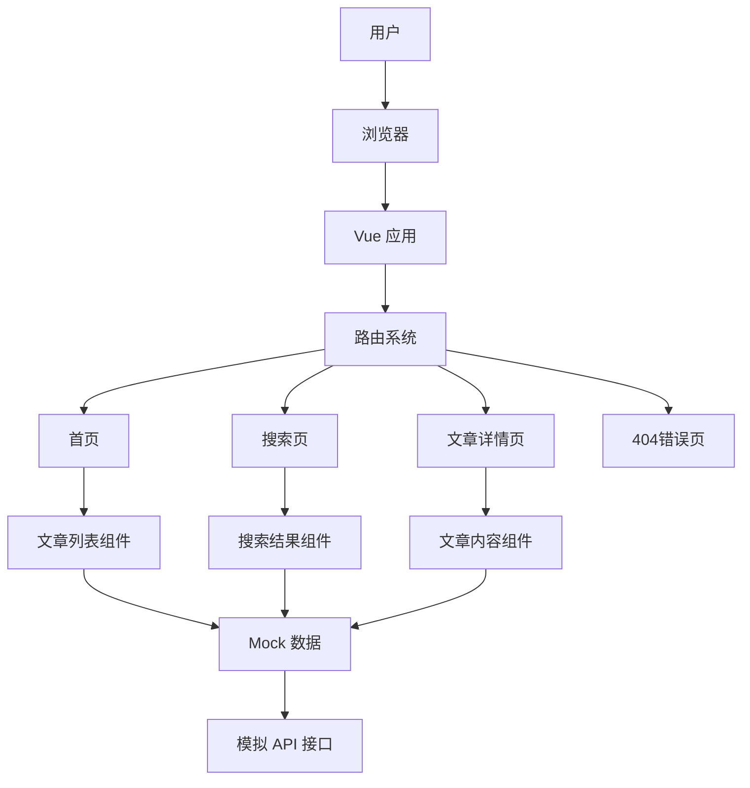

# YaollWeb

一个基于 Vue 3 + Vite + Element Plus 的现代前端项目，用于展示文章列表、搜索和文章详情功能。

## 技术栈

- **前端框架**: Vue 3
- **构建工具**: Vite 3.2.4
- **路由**: Vue Router 4
- **UI 库**: Element Plus
- **HTTP 客户端**: Axios
- **模拟数据**: Mock.js
- **Markdown 解析**: Markdown-it

## 架构图



## 版本说明

| 版本 | 日期 | 描述 |
|------|------|------|
| v1.0.0 | 2023-10-01 | 项目初始化，基于 Vue 3 + Vite |
| v1.1.0 | 2023-10-02 | 添加路由系统和页面组件 |
| v1.2.0 | 2023-10-03 | 实现文章列表和详情功能 |
| v1.3.0 | 2023-10-04 | 添加搜索功能和模拟数据 |
| v1.4.0 | 2023-10-05 | 优化 UI 设计和响应式布局 |

## 安装和运行

### 环境要求

- Node.js 14.18.0 或更高版本
- npm 6.14.15 或更高版本

### 安装依赖

```bash
npm install
```

### 开发模式运行

```bash
npm run dev
```

项目将在 http://localhost:8080 启动。

### 构建生产版本

```bash
npm run build
```

构建产物将输出到 `dist` 目录。

## 项目结构

```
YaollWeb/
├── public/            # 静态资源
├── src/
│   ├── assets/        # 资源文件
│   │   └── styles/    # 样式文件
│   ├── components/    # 公共组件
│   ├── mock/          # 模拟数据
│   ├── router/        # 路由配置
│   ├── views/         # 页面组件
│   ├── App.vue        # 根组件
│   └── main.js        # 入口文件
├── index.html         # HTML 模板
├── package.json       # 项目配置
├── vite.config.js     # Vite 配置
└── README.md          # 项目说明
```

## 功能介绍

### 首页
- 展示文章列表
- 支持加载更多文章
- 响应式布局，适配不同屏幕尺寸

### 搜索页
- 支持关键词搜索
- 展示搜索结果
- 无结果提示

### 文章详情页
- 展示文章内容
- 支持 Markdown 和 HTML 格式
- 相关文章推荐

### 404错误页
- 处理不存在的路径
- 提供返回首页的链接

## 模拟数据

项目使用 Mock.js 模拟 API 接口，包括：

- `/api/articles` - 获取文章列表
- `/api/articles/more` - 加载更多文章
- `/api/articles/{id}` - 获取文章详情
- `/api/articles/related` - 获取相关文章
- `/api/search` - 搜索文章

## 响应式设计

- 桌面端：完整布局，多列展示
- 平板端：适配中等屏幕，调整布局
- 移动端：单列布局，优化触摸体验

## 浏览器支持

- Chrome (最新版本)
- Firefox (最新版本)
- Safari (最新版本)
- Edge (最新版本)

## 贡献指南

1. Fork 本仓库
2. 创建你的特性分支 (`git checkout -b feature/amazing-feature`)
3. 提交你的更改 (`git commit -m 'Add some amazing feature'`)
4. 推送到分支 (`git push origin feature/amazing-feature`)
5. 打开一个 Pull Request

## 许可证

本项目采用 MIT 许可证。详见 [LICENSE](LICENSE) 文件。

## 联系方式

- 项目地址: https://github.com/yourusername/YaollWeb
- 作者: Your Name
- 邮箱: your.email@example.com
